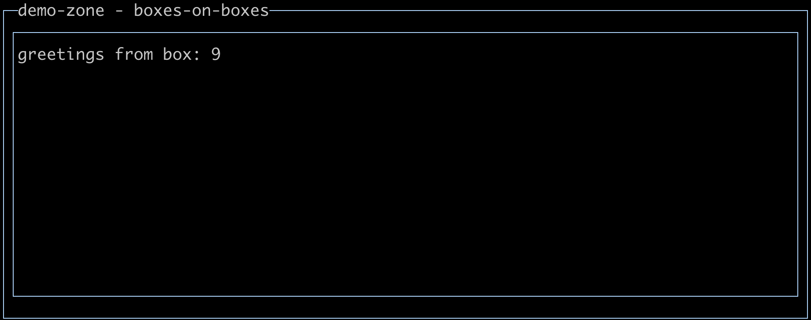
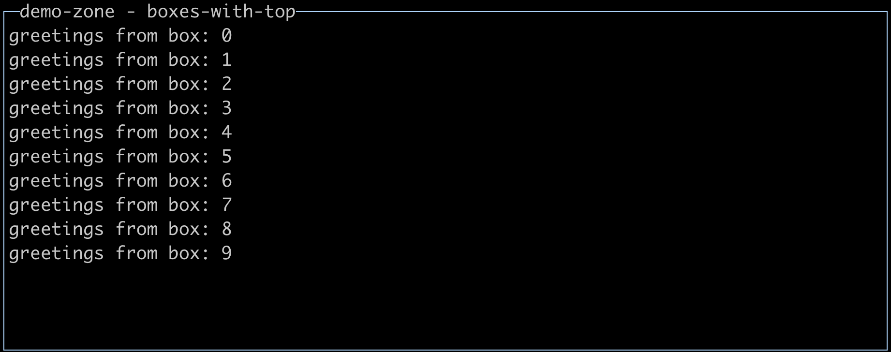
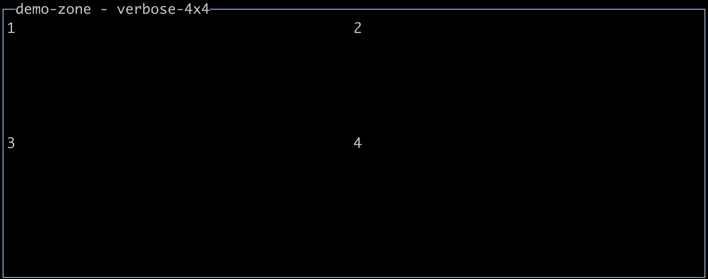
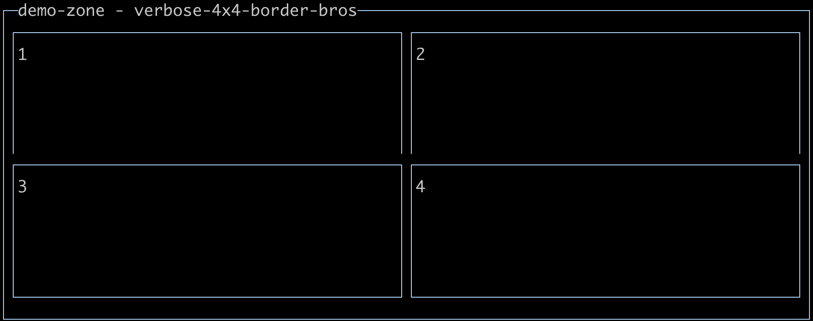
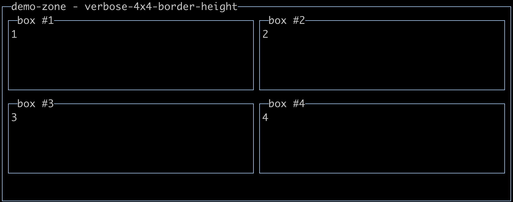
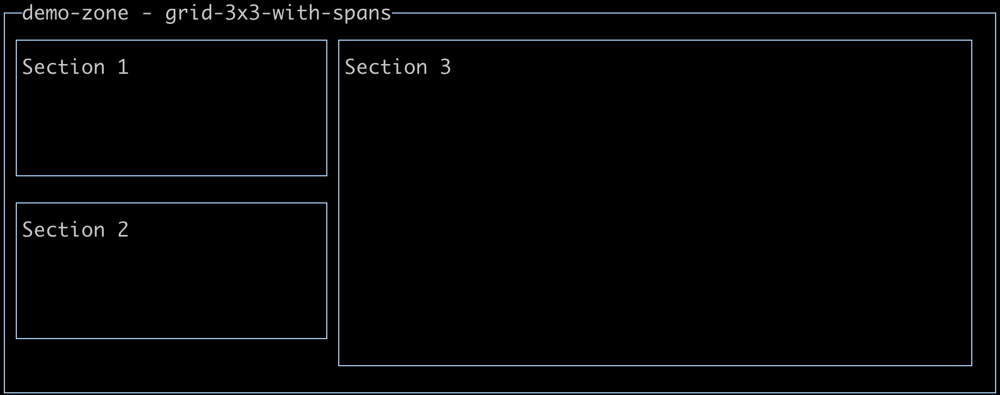

# Manual

## Welcome

Thanks for checking out `react-tui`. This library wouldn't exist without the
fantastic work from the following projects:

- [react](https://github.com/facebook/react)
- [blessed](https://github.com/chjj/blessed)
- [react-blessed](https://github.com/Yomguithereal/react-blessed)

So why another library? **Most importantly, to improve the usability of react-blessed
and blessed**. Blessed is an imperative API for building terminal UIs.
It is unopinionated on application structure or architecture (MVC, MVVM, MVP, etc),
which lets us pair nicely with react. React can be adapted to various architectures,
including those that _popularized react_, letting UI be a declartive, pure function of a data model. `react-blessed` took a stab at marrying those domains, and tried an
approach that took react props and passed them directly into blessed widget
contructors, or modified blessed widget attributes on update. In fact, that's
still what were doing here in `react-tui`, but _with more_. What more?

- `Typescript` support. Blessed APIs are wide, sometimes redundant, and hard to piece together
  for newcomers. By applying Typescript, your react-tui/blessed prop inputs will
  be checked, to a moderate extent. You also gain _some_ discoverability of how to use
  components without leaving your editor.
- First class component API. This component API will make it easier to
  to import building blocks into your react app, and discover APIs within them. It
  also adds support and workarounds for various blessed-react compatibility issues.
- Various utilities to make blessed/terminal/react interop a
  bit less painless, such as coloring and text formatting.

**Aside for @types/react users**--`JSX.IntrinsicElements` are not augmented by `react-tui`.
The Typescript community early on assumed that react would only be used
in web, so currently the prop
defitions for web ship with `@types/react` versus `@types/react-dom`. Consequently,
we cannot give first class type definitions for what we _really_ pass into the
react-reconciler (e.g. `"text"`, `"textarea"`, etc) as they conflict with web types.
Fear not--the exported component library has all of typescript goodies
worked out fine 👌.

## Getting started

See the [readme.md](../readme.md) for how to install react-tui into your project.

## Understanding components

If you are a web developer or a react-native developer, developing with
react-tui will be challenging at first. Your terminal does not have an
excellent box model like we are used to in those environments, and available
API implementations in this space are both more limited and subjectively
less robust. Understanding what react-tui is doing behind the scenes _will_
help you.

`react-tui` ships a component library. It's important to be aware that
components in `react-tui` are:

- generally abstractions over [blessed::Widgets](https://github.com/embarklabs/neo-blessed#base-nodes)
- children of a parent [blessed::Widget](https://github.com/embarklabs/neo-blessed#base-nodes)
- rendered inside of a [blessed::Screen](https://github.com/embarklabs/neo-blessed#screen-from-node)

```tsx
import { Box } from "@dino-dna/react-tui/components";
render(<Box {...props} />);
/* ^ eventually yields => */ blessed.box(props);
```

## Preparing the TUI

Much like in the browser when using react, we need an initial, target element
to render into. So too is the case with `react-tui`.

Users are responsible for:

- creating a screen
- creating an element on the screen to mount your react application into

```tsx
// demo.tsx
import React from "react";
import blessed from "neo-blessed";
import { createBlessedRenderer } from "@dino-dna/react-tui";
const screen = blessed.screen({
  /* ... */
});
screen.key(["q", "C-c"], () => process.exit(0));
const render = createBlessedRenderer(blessed, screen);
const container = blessed.box();
screen.append(container);
// preparation complete!
// now you are free to pass control off to react!
render(<>Greetings from react-tui</>, container);
// ^look familiar?
// This is roughly the same API as ReactDOM.render(el, container)
```

## Using react blessed components

### Positioning

As mentioned before, blessed does not have a flowing box model under the hood.
What happens if you just add a bunch of boxes to your app?

```tsx
// boxes-on-boxes
import { Box } from "@dino-dna/react-tui/components";
render(
  <>
    {[...Array(10)].map(_, i) => <Box>{`greetings from box: ${i}`}</Box>}
  </>
)
```



What's even happening here? All of the boxes are stacking atop one another.
Let's try again, using the `top` prop. This will tell how many lines _offset_
from the top to paint the new node.

```tsx
// boxes-with-top
import { Box } from "@dino-dna/react-tui/components";
render(
  <>
    {[...Array(10)].map(_, i) => <Box top={i}>greetings from box: {i}</Box>}
  </>
)
```



Much better. Let's try a more _interesting layout_.

```tsx
// verbose-4x4
import { Element, Box } from "@dino-dna/react-tui/components";
render(
  <Element>
    <Box left={0} top={0} width="50%" children={1} />
    <Box left="50%" top={0} width="50%" children={2} />
    <Box left={0} top="50%" width="50%" children={3} />
    <Box left="50%" top="50%" width="50%" children={4} />
  </Element>
);
```



If this feels like writing old-skool HTML `<table />`s, that's because it is.
And it's not so bad either! In a hot second, we'll see how we can reduce
the amount of boilerplate and math you may want to do, especially to support
colspan and rowspans. But first, let's look deeper at box widths. Using the same
example, let's apply _border styles_.

```tsx
// verbose-4x4-border-bros
import { Element, Box } from "@dino-dna/react-tui/components";
const styles = {
  border: { type: "line" },
  style: { border: { fg: "blue" } },
};
render(
  <Element>
    <Box left={0} top={0} width="50%" {...styles}>
      1
    </Box>
    <Box left="50%" top={0} width="50%" {...styles}>
      2
    </Box>
    <Box left={0} top="50%" width="50%" {...styles}>
      3
    </Box>
    <Box left="50%" top="50%" width="50%" {...styles}>
      4
    </Box>
  </Element>
);
```



Hmm. Not bad. But clearly _not right_. **Where's that darned bottom border?**

What if we specify a `height="50%"` on each node? Maybe a `label` as well?



Cool. Cool-Tools™.

But who ever has a layout that is a just a 4x4 grid?
More often, you'll want some sort of variable width panes or spanning action. That's where
`<Grid />` comes in. Grid asks that you setup all possible square sections,
then lets you snap components into those sections. It's not as snazzy as CSS
Grid, but it is better than doing the math on your own. Let's make a view with
three sections. Section 1, top-left, 1/3 wide, 1/2 tall. Section 2, middle-left,
1/3 wide, 1/2 tall. Section 3, starting at 1/3 left, 2/3 wide, full height.

That may be hard to grok, so let's see the output _first_ this time:



```tsx
import { Element, Box, Grid } from "@dino-dna/react-tui/components";
render(
  <Grid
    cols={3} // allow us to have 1/3 increment widths
    rows={2} // allow us to have 1/2 increment heights
    items={[
      {
        row: 0,
        col: 0,
        render: (props) => (
          // props have all of our positioning data precomputed. pass em thru!
          <Element {...props} {...styles} children="Section 1" />
        ),
      },
      {
        row: 1,
        col: 0,
        render: (props) => (
          <Element {...props} {...styles} children="Section 2" />
        ),
      },
      {
        row: 0,
        col: 1,
        rowSpan: 2,
        colSpan: 2,
        render: (props) => (
          <Element {...props} {...styles} children="Section 3" />
        ),
      },
    ]}
  />
);
```

It's a bit verbose. Ideas on improved APIs? Send a patch ;).

### Interactivity

Now things get interesting. `react-tui` offloads all aspects of interactivity
to blessed. When any question arises or quirk is observed using the interactivity APIs,
it's recommendend to go straight to the `blessed` docs, and study the matching
prop/attribute.

The main way users interact with TUIs is their keys. Keys are used
for content input and navigation. Let's look at the macro interactive modes and
what you may need to do to enable them in your react components.

- Accepting key input
  - `keys` prop - If you want the user to be able to interact with you component you ought apply the `keys` prop to the component. It is not universal on all elements, but common.
    - You may expect `<Textbox label="textbox" />` to allow for character input on its own--but infact it does not.
    - **This is in stark contrast to web apis**, where input controls (e.g. `<input type="text" />`) are by default interactable on focus.
    - **When the user focuses your:**:
      - _input element_: the `return/enter` key puts the user into text input mode. e.g. you can enter text into a `<Textbox />`. `Esc` restores the prior tab focus.
      - _non-input element_: expect desired key behavior on the focused node. e.g. you should be able scroll a scrollable `<List />` with arrow keys if content is available.
  - `inputOnFocus` - may be applied to input controls
    - On focus, the user is automatically now entering text
    - Consider using this sparingly. it can be jarring to a user tabbing through a UI and then suddent _stopped_ from navigation--the tab is entered instead as a proper tab.
      - `inputOnFocus` is probably best suited for usage only in `<Form />`s.
- Tab focusing
  - Various props make a node focusable. `keys` or example. Can be controlled and contained within a box, but `react-tui` provides no HOCs (yet?) to help control that behavior. Using `ref`s, you can hook into blessed nodes to do any sort of special focus customization you may need.
- Mouse/Scroll
  - `mouse` - a common prop analogous to `keys`, but for mouse input. Scrolling and focus can now occur additionally via mouse.
  - `scrollable` - a common prop to allow overflowed contents to be accessible. `keys` or `mouse` ought generally be appliend in tandem to access such content.

## Styling Best-Known-Methods

- Communicate focus on interactive views.
  - In some cases, a blinking cursor is enough. In bordered views, consider changing attributes on focus:

```ts
{
  border: { type: "line" },
  style: {
    border: { fg: "blue" },
    focus: {
      border: { fg: "red" },
    },
  },
}
```

## Component API

Component API exposed from `@dino-dna/react-tui/components`:

```tsx
// node_modules/@dino-dna/react-tui/components/index.d.ts
// This md file is probably outdated. check your locally copy instead.
import * as React from "react";
import { Widgets } from "neo-blessed";
import { RBProps } from "./util/blessed-react-compat";
import { NodeEventHandler } from "./util/eventHandlers";

export declare const Box: React.FC<RBProps<Widgets.BoxOptions, Widgets.BoxElement>>;
export declare const Bigtext: React.FC<RBProps<Widgets.BigTextOptions, Widgets.BigTextElement>>;
export declare const Button: React.FC<
  RBProps<Widgets.ButtonOptions, Widgets.ButtonElement> & {
    onpress?: NodeEventHandler;
  }
>;
export declare const Checkbox: React.FC<RBProps<Widgets.CheckboxOptions, Widgets.CheckboxElement>>;
export declare const Element: React.FC<RBProps<Widgets.ElementOptions, Widgets.BlessedElement>>;
export declare const FileManager: React.FC<RBProps<Widgets.FileManagerOptions, Widgets.FileManagerElement>>;
export declare const Form: React.FC<
  RBProps<Widgets.FormOptions, Widgets.FormElement<{}>> & {
    onsubmit?: <T = {}>(data: T) => void;
  }
>;
export declare const Input: React.FC<RBProps<Widgets.InputOptions, Widgets.InputElement>>;
export declare const Image: React.FC<RBProps<Widgets.ImageOptions, Widgets.ImageElement>>;
export declare const Line: React.FC<RBProps<Widgets.LineOptions, Widgets.LineElement>>;
export declare const List: React.FC<RBProps<Widgets.ListOptions<any>, Widgets.ListElement>>;
export declare const ListBar: React.FC<RBProps<Widgets.ListbarOptions, Widgets.ListbarElement>>;
export declare const ListTable: React.FC<Omit<RBProps<Widgets.ListTableOptions, Widgets.ListTableElement>, "items">>;
export declare const Log: React.FC<RBProps<Widgets.LogOptions, Widgets.Log>>;
export declare const Loading: React.FC<RBProps<
  Widgets.LoadingOptions & {
    message: string;
    isLoading?: boolean;
  },
  Widgets.LoadingElement
>>;
export declare const Message: React.FC<RBProps<Widgets.MessageOptions, Widgets.MessageElement>>;
export declare const ProgressBar: React.FC<RBProps<Widgets.ProgressBarOptions, Widgets.ProgressBarElement>>;
export declare const Prompt: React.FC<
  RBProps<Widgets.PromptOptions, Widgets.PromptElement> & {
    text: string;
    defaultValue?: string;
    onResponse: (responseText: string) => void;
  }
>;
export declare const Question: React.FC<
  RBProps<Widgets.QuestionOptions, Widgets.QuestionElement> & {
    text: string;
    onResponse: (response: boolean) => void;
  }
>;
export declare const RadioButton: React.FC<RBProps<Widgets.RadioButtonOptions, Widgets.RadioButtonElement>>;
export declare const RadioSet: React.FC<RBProps<Widgets.RadioSetOptions, Widgets.RadioSetElement>>;
export declare const ScrollableBox: React.FC<RBProps<Widgets.ScrollableBoxOptions, Widgets.BoxElement>>;
export declare const ScrollableText: React.FC<RBProps<Widgets.BoxOptions, Widgets.BoxElement>>;
export declare const Table: React.FC<RBProps<Widgets.TableOptions, Widgets.TableElement>>;
export declare const Text: React.FC<RBProps<Widgets.TextOptions, Widgets.TextElement>>;
export declare const Textarea: React.FC<
  RBProps<Widgets.TextareaOptions, Widgets.TextareaElement> & {
    onsubmit?: (res: any) => void;
  }
>;
export declare const Textbox: React.FC<
  RBProps<Widgets.TextboxOptions & Widgets.TextareaOptions, Widgets.TextElement> & {
    onsubmit?: (res: any) => void;
  }
>;
export declare const Terminal: React.FC<RBProps<Widgets.TerminalOptions, Widgets.TerminalElement>>;
```

## Debugging

- `REACT_TUI_DEBUG_LOG` - set to a filename, e.g. `debug.log` to turn on various streaming log datas.

## What else?

The minimal covered content above should enable you to be somewhat productive.
Other, omitted key concepts are covered in the associated technology docs.

## The future

`blessed` is great, but it is not actively maintained. `neo-blessed` claims maintenance, and
does exhibit some activity, but isn't necessarily a flourishing community either.
No ill will indended, of course :).

Long term, decoupling our component API from blessed widgets and use lower level blessed's
primitives will improve some issues. We may refactor non-widget code
from blessed into Typescript and help contribute to move that community forward.
We may consider dropping blessed outright and seeing our react components play
nicely with Cedric's [WIP Document Model](https://github.com/cronvel/terminal-kit/blob/HEAD/doc/document-model.md#top).
TBD. You tell us what you think--let's do it together! :)
