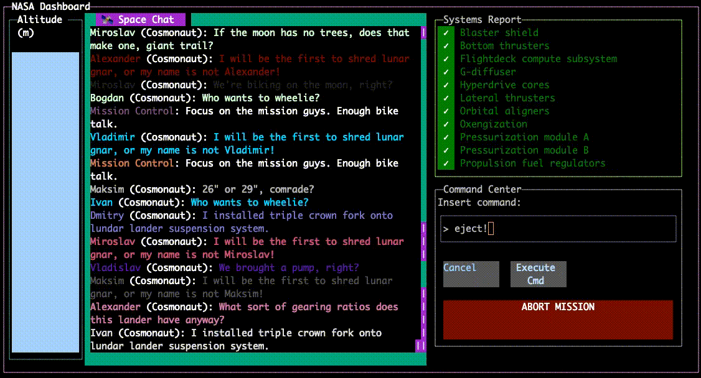

# @dino-dna/react-tui <!-- omit in toc -->

React in your terminal emulator.



react-tui is both:

- a **component library**, and
- a **react reconciler** for rendering `blessed`-style widgets into react

This project was originally a fork of [react-blessed](https://github.com/Yomguithereal/react-blessed) to add Typescript, but soon became a moderate rewrite of the reconciler with a component library and a growing visual test suite.

## Table Of Contents  <!-- omit in toc -->

- [Install](#install)
- [Usage](#usage)
  - [Manual & API](#manual--api)
  - [Rendering a basic application](#rendering-a-basic-application)
  - [Demo](#demo)

## Install

```sh
npm install --prod @dino-dna/react-tui neo-blessed react
# or,
yarn add @dino-dna/react-tui neo-blessed react
```

## Usage

### Manual & API

[Click here to visit the manual](./docs/manual.md).

If you are a web developer or a react-native developer, developing with
react-tui will be challenging at first. Your terminal does not have an
excellent box model like we are used to in those environments, and available
API implementations in this space are both more limited and subjectively
less robust. We strongly recommend reading the [manual](./docs/manual.md)
before trying to write a nice terminal app.

### Rendering a basic application

```tsx
// get-started.tsx
import React from 'react';
import blessed from 'neo-blessed';
import { createBlessedRenderer } from '@dino-dna/react-tui';
// setup a blessed screen & container
const screen = blessed.screen({ /* ... */ });
screen.key(['q', 'C-c'], () => process.exit(0));
const render = createBlessedRenderer(blessed, screen);
const container = blessed.box();
screen.append(container);
// initialize react
const DemoApp: React.FC = () => <>Greetings from react-tui</>;
render(<DemoApp />, container);
// ^look familiar? same API as ReactDOM.render(el, container)
```

### Demo

We host a variety of runnable demos. To run the the demo app:

- clone, `git clone https://github.com/dino-dna/react-tui react-tui`
- `cd react-tui`
- install dependencies, `npm ci`
- compile, `npx tsc` (or `npx tsc -w` for watch mode)
- run the demo, `npm run demo`
